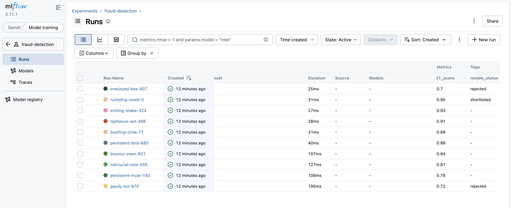

# Search and Query MLflow Runs

## Problem

A xFusionCorp Industries data scientist has accumulated ten runs in the `fraud-detection` MLflow experiment. Your task is to triage those runs via the MLflow UI: mark the single best-performing candidate as the shortlisted model, and flag every clearly under-performing run for removal.

1. The MLflow tracking server is already running on port `5000`, and the `fraud-detection` experiment has been pre-populated with ten runs. The runs can be viewed via the MLflow UI button → `fraud-detection` experiment.

2. Using the MLflow UI, complete the triage below. The end state is what is tested—the path taken through the UI is not.

    - **Shortlist the best candidate**. Among all runs where `metrics.f1_score > 0.85`, the single run with the highest `f1_score` must carry a run-level tag: key `review-status`, value `shortlisted`.

    - **Reject the under-performers**. Every run where `metrics.f1_score < 0.75` must carry a run-level tag: key `review-status`, value `rejected`.

3. The other runs (those in the 0.75 ≤ f1 ≤ 0.85 band, and the second-best shortlisting candidate) must carry no `review-status` tag at all.

## Solution

1. Using the Mlflow UI button, open the UI in a new tab.
2. Make sure you are on model training > experiments > fraud-detection
3. You will see runs tab on the sidebar. Let's click on it.
4. A couple of runs are listed there. 
5. Click on columns and then click on metrics. Then you can see the f1_score for each runs. 
6. Now, click on the search bar, you will have options to select metrics.f1_score > select it and add a function like: **`> 0.85`** > hit enter. 
7. From the shortlist of runs, select the best one and add tags: `review-status: shortlisted` > then save it. 
8. Similarly, change the function like: **`< 0.75`** > hit enter and you will list of runs those have score below it. Click on the name to select all of them and add tags: `review-status: rejected` > then save it. 
9. That's all.
10. you can check by selecting columns > mark on tags

